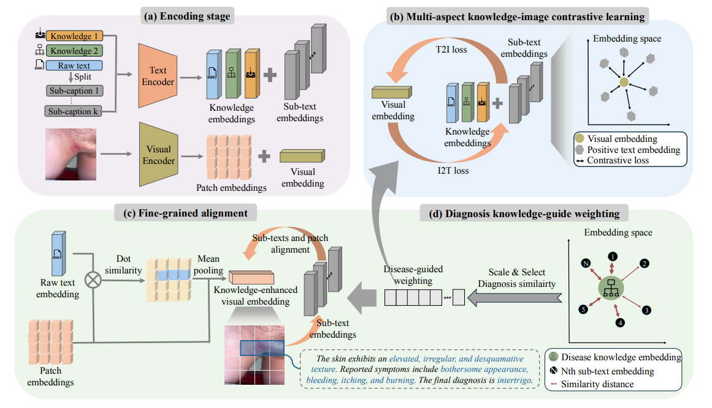

# [MICCAI‘25] MAKE: Multi-Aspect Knowledge-Enhanced Vision-Language Pretraining for Zero-shot Dermatological Assessment 

[](https://www.arxiv.org/abs/2505.09372) 
[](#citation)

## Abstract

Dermatological diagnosis represents a complex multimodal challenge that requires integrating visual features with specialized clinical knowledge. We introduce MAKE, a Multi-Aspect Knowledge-Enhanced vision-language pretraining framework for zero-shot dermatological tasks. Our approach addresses the limitations of existing vision-language models by decomposing clinical narratives into knowledge-enhanced subcaptions, connecting subcaptions with relevant image features, and adaptively prioritizing different knowledge aspects. Through pretraining on 403,563 dermatological image-text pairs, MAKE significantly outperforms state-of-the-art VLP models on eight datasets across zero-shot skin disease classification, concept annotation, and cross-modal retrieval tasks.

<p align="center">
     <br>
</p>

## Resources

- 📦 **Code and pretrained model** will be released in this repository
- 🔍 **Pretraining data** will be available at [Derm1M Repository](https://github.com/SiyuanYan1/Derm1M)

## Update
- [x] 20/06/2025: Released the MAKE checkpoint and the evaluation pipeline
- [ ] Coming Soon: Guidelines for evaluating MAKE on custom datasets
- [ ] Within 3 weeks: Training code release

## ⚙️ Environment Preparation
Setup conda environment (recommended).
```bash
conda create -n MAKE python=3.9.20
conda activate MAKE
```

Clone MAKE repository and install requirements
```bash
git clone git@github.com:SiyuanYan1/MAKE.git
cd MAKE
pip install -r requirements.txt
```

## 🚀 Quick start
Our model is available on Hugging Face for easy access.
Here we provide a [simple example](assets/example.ipynb)  demonstrating zero-shot disease classification using MAKE in just 43 lines of code.


## Data Preparation
- Download our downstream tasks dataset from [Google Drive](https://drive.google.com/file/d/1QysyixFNW3F7XmOOHkUczkvSlXV6qavc/view?usp=sharing), unzip it, and place the contents in the `data/` directory.

Once downloaded, your project directory should be organized as follows:

**Expected Project Structure**
```bash
├── concept_annotation
│   ├── automatic_concept_annotation.py
│   ├── dataset.py
│   ├── infer.py
│   ├── model.py
│   ├── term_lists
│   └── utils.py
├── data
│   ├── derm7pt
│   ├── F17K
│   ├── PAD
│   ├── SD-128
│   ├── skin_cap
│   ├── skincon
│   └── SNU
├── README.md
├── requirements.txt
├── script
│   ├── concept_annotation_script_open_clip.sh
│   └── test.sh
└── src
    ├── CAE
    ├── infer.py
    ├── main.py
    ├── open_clip
    ├── open_clip_train
    └── test.py
```

## Evaluation

### Zero-Shot Disease Classification
* Evaluates the model's ability to classify skin diseases without task-specific training, using only natural language descriptions of disease categories.
* Metric: Accuracy
* Note: We use specialized prompt templates (`OPENAI_SKIN_TEMPLATES` in [`src/open_clip/zero_shot_metadata.py:120`](src/open_clip/zero_shot_metadata.py#L120)) that are optimized for dermatological contexts, providing diverse phrasings to improve robustness across different linguistic expressions of medical concepts.


```bash
python src/test.py \
    --val-data=""  \                           
    --dataset-type "csv" \
    --batch-size 2048 \                       # Batch size for inference
    --zeroshot-eval1=data/PAD/MAKE_PAD.csv \         # PAD dataset csv
    --zeroshot-eval2=data/F17K/MAKE_F17K.csv \       # F17K dataset csv
    --zeroshot-eval3=data/SNU/MAKE_SNU.csv \         # SNU dataset csv
    --zeroshot-eval4=data/SD-128/MAKE_SD-128.csv \   # SD128 dataset csv
    --csv-label-key label \                   # Column name for class labels in CSV
    --csv-img-key filename \                  # Column name for image filenames in CSV
    --model 'hf-hub:xieji-x/MAKE'           # MAKE checkpoint from Hugging Face Hub
```


### Concept Annotation 
- Evaluates the model's ability to identify clinical and dermascopic features in dermatological images using MAKE.

- **Clinical Concept Annotation**: Identifies visual concepts in clinical dermatological images using the SkinCon dataset with 32 skin conditions and clinical concept annotations.

- **Dermascopic Concept Annotation**: Recognizes dermascopic concepts(pigment network, blue whitish veil, etc.) using the Derm7pt dataset based on the 7-point checklist.

- Metric: AUROC

```python
# Clinical concept annotation (SkinCon dataset)
python concept_annotation/automatic_concept_annotation.py \
    --model_api open_clip_hf-hub:xieji-x/MAKE \
    --data_dir "data/skincon" \                     # Directory containing clinical images
    --batch_size 32 \                              # Batch size for processing images
    --concept_list "data/skincon/concept_list.txt" \    # Clinical concept names (32 concepts)
    --concept_terms_json "concept_annotation/term_lists/ConceptTerms.json"  # JSON mapping concepts to synonyms

# Dermascopic concept annotation (Derm7pt dataset)
python concept_annotation/automatic_concept_annotation.py \
    --model_api open_clip_hf-hub:xieji-x/MAKE \
    --data_dir "data/derm7pt" \                     # Directory containing dermascopic images
    --batch_size 32 \
    --concept_list "data/derm7pt/concept_list.txt" \    # Dermascopic concept names (7-point checklist)
    --concept_terms_json "concept_annotation/term_lists/ConceptTerms.json"
```

### Cross-Modality Retrieval 
* Evaluates the model's ability to retrieve relevant images given text descriptions and vice versa in dermatological contexts.
* Metrics: Recall@10, Recall@50, Recall@100
```python
python src/main.py \
    --val-data="data/skin_cap/skin_cap_meta.csv" \    # SkinCap dataset metadata
    --dataset-type "csv" \                            # Dataset format
    --batch-size=2048 \                               # Batch size for retrieval
    --csv-img-key filename \                          # Column name for image filenames
    --csv-caption-key 'caption_zh_polish_en' \        # Column with EN captions
    --model 'hf-hub:xieji-x/MAKE'                    # MAKE checkpoint from Hugging Face
```


## Citation

If you find our work useful in your research, please consider citing our papers:

```bibtex
@misc{yan2025makemultiaspectknowledgeenhancedvisionlanguage,
      title={MAKE: Multi-Aspect Knowledge-Enhanced Vision-Language Pretraining for Zero-shot Dermatological Assessment}, 
      author={Siyuan Yan and Xieji Li and Ming Hu and Yiwen Jiang and Zhen Yu and Zongyuan Ge},
      year={2025},
      eprint={2505.09372},
      archivePrefix={arXiv},
      primaryClass={cs.CV},
      url={https://arxiv.org/abs/2505.09372}, 
}

@misc{yan2025derm1mmillionscalevisionlanguagedataset,
      title={Derm1M: A Million-scale Vision-Language Dataset Aligned with Clinical Ontology Knowledge for Dermatology}, 
      author={Siyuan Yan and Ming Hu and Yiwen Jiang and Xieji Li and Hao Fei and Philipp Tschandl and Harald Kittler and Zongyuan Ge},
      year={2025},
      eprint={2503.14911},
      archivePrefix={arXiv},
      primaryClass={cs.CV},
      url={https://arxiv.org/abs/2503.14911}, 
}
